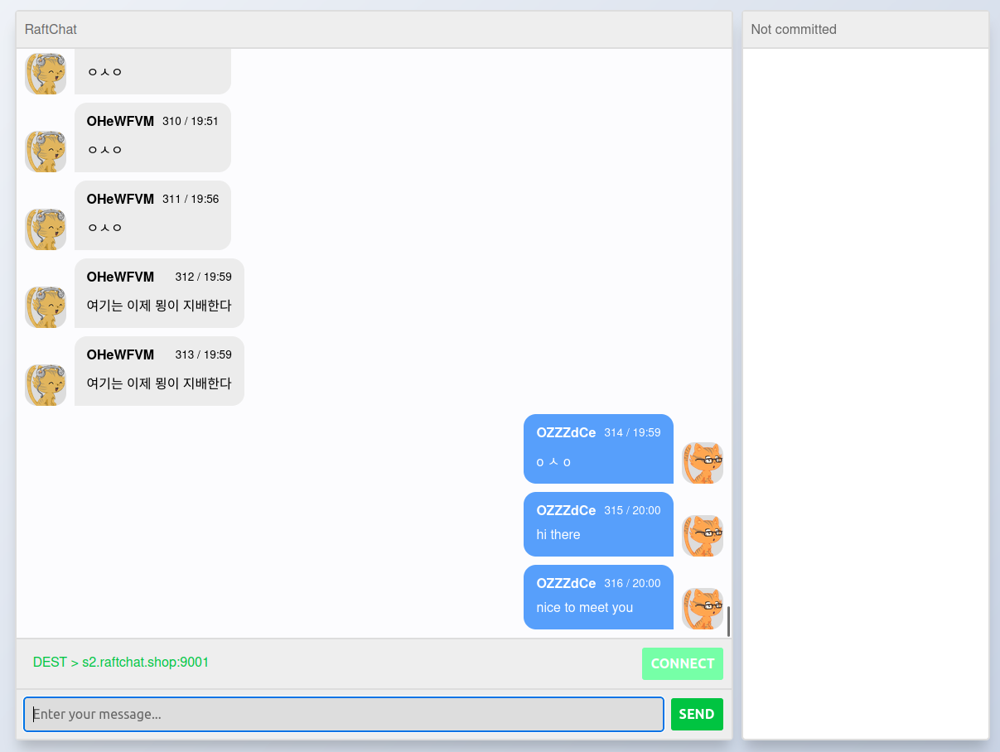
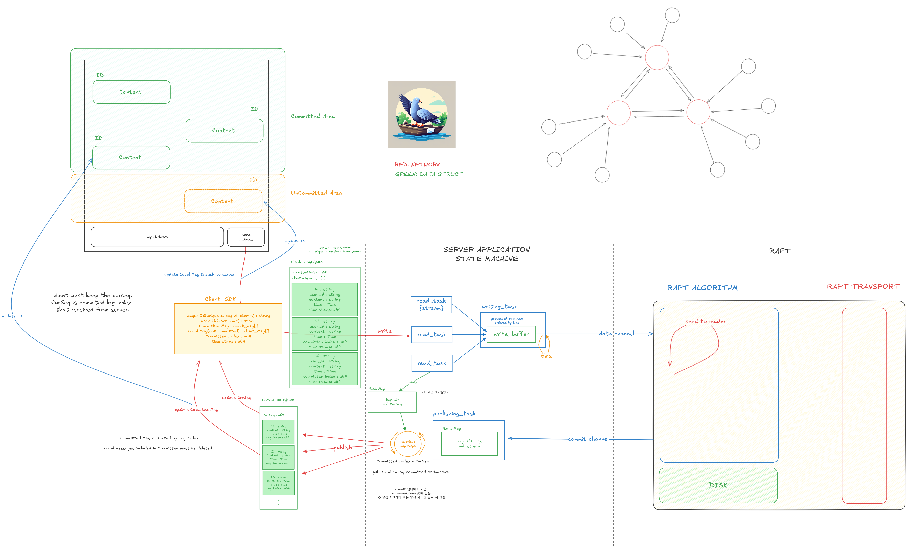
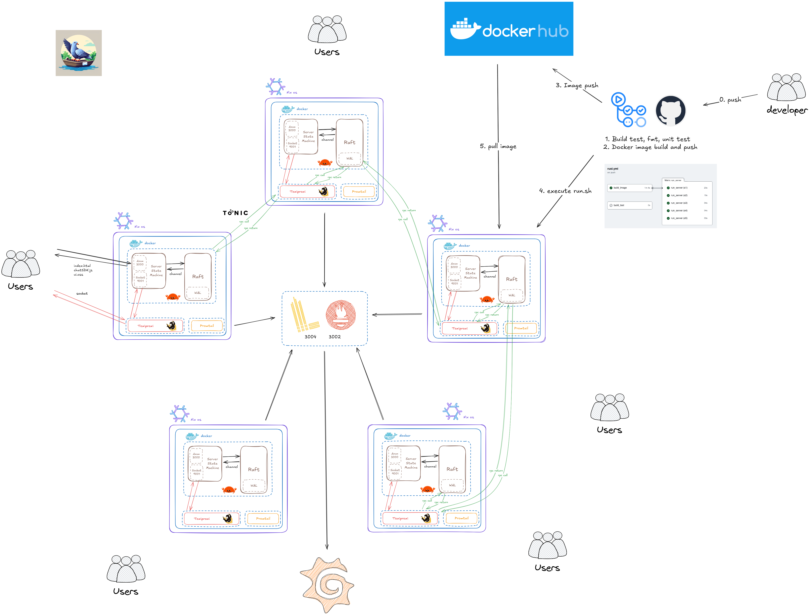

<p align="center"></p>


# RaftChat
Chatting system using [raft protocol](https://raft.github.io/)

## Note

https://hackmd.io/@jFaa8ow5QGS_siogO7YAkg/rk66Hkc-Jl

## UI


## Architecture




## License of dependencies

https://crates.io/crates/cargo-license

```rust 
cargo license
```

## Local server test

```shell
$ ./local_test.sh 0 & // server index
$ ./local_test.sh 1 &
$ ./local_test.sh 2 &
```

client url
- 127.0.0.1:3000
- 127.0.0.1:3001 
- 127.0.0.1:3002

## Build

```shell
$ cargo build
$ ./target/debug/server -h
Usage: server [OPTIONS]

Options:
  -c, --config <config path>  path of config.env
  -l, --log <log yaml path>   path of log4rs.yml
  -d, --debug                 debug mode
  -r, --raft-mock-flag        raft mock flag
  -h, --help                  Print help
  -V, --version               Print version
```

## Config file

```cfg
SELF_DOMAIN_IDX=0 // server's index
                  // this server use "example0.com" 9000, 3000, 3010

DOMAINS="example0.com,example1.com,example2.com" // Domains for each server
SOCKET_PORT="9000,9001,9002"                     // Web socket port for each server
WEB_PORT="3000,3001,3002"                        // Web port for each server
RPC_PORT="3010,3011,3012"                        // RPC port for each server

VERSION="0.2.0"
REFRESH_TOKEN="random_value"                     // If the client's token is different from this token,
                                                 // the client deletes the local repository
```


## Git action local test

```shell
touch my.secrets // for git secret key

act --secret-file my.secrets  -P ubuntu-latest=-self-hosted
```
